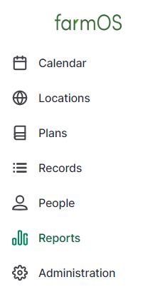
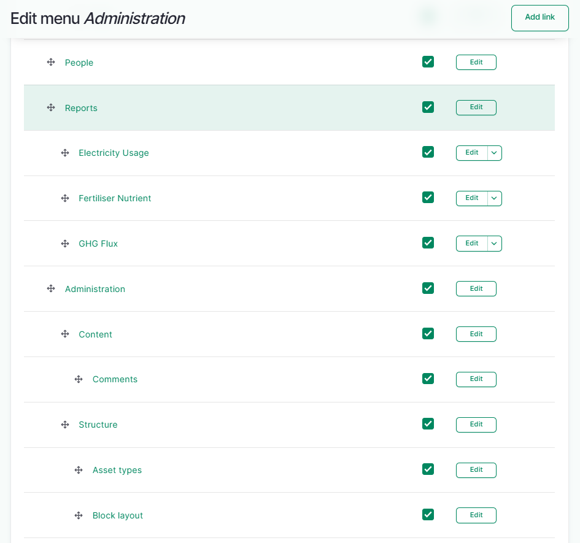
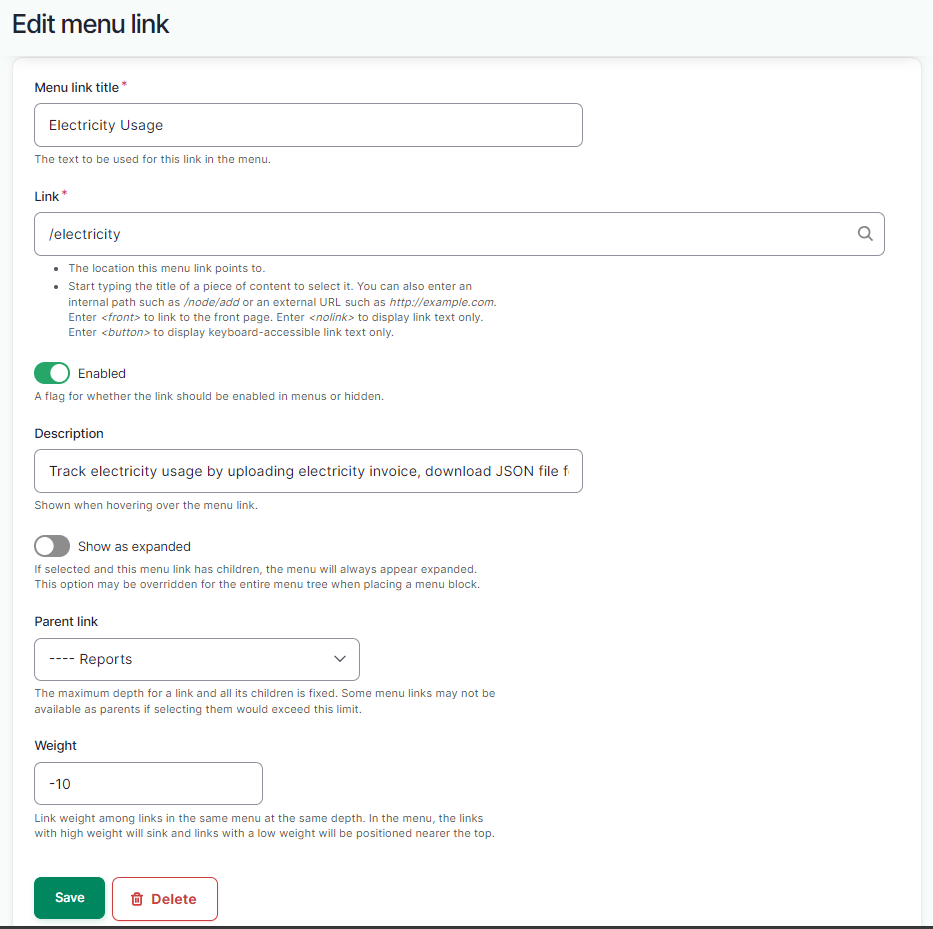
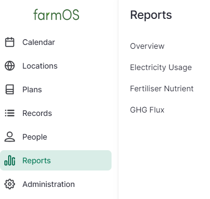
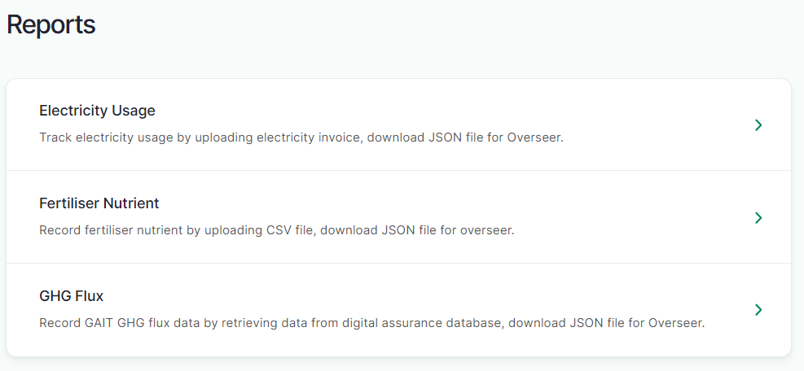
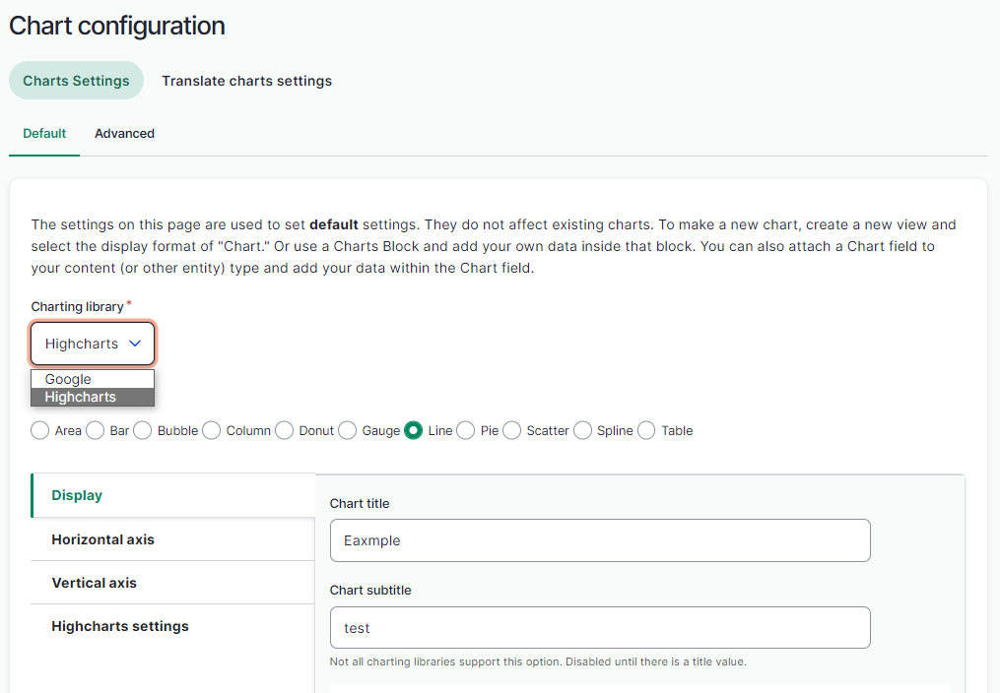

# Farm Digital Assurance Prototype System Module

The farmOS example modules are built using Drupal (CMS). Back-end programming language is PHP, database is PostgreSQL.

## Configure Menu for Reports

Install "farmOS Report" module from Administration-Extend. The farmOS main menu will appear "Reports".

Add submenu in "Reports", go to Administration - Structure - Menu - Edit Menu, you will find the menu structure and edit it.

Add Link. You need to create a Menu link tile, add the link url, and choose Reports as the parent link. 

Then the submenu will appear. The Report menu structure and content are generated successfully.

## Electricity Usage Module

### Installation

1. Compress the electricity_usage_v1 folder into *.zip, or *.tar.gz, upload the compressed file using "Add New Modules" in farmOS, install and enable this module

2. Search Electricity Usage V1 module, install it

2. Install required modules: "Charts", "Highcharts", "Page popup"

3. Go to Administration - Configuration - Content authoring - Charts configuration, select "Highcharts" as the Charting library.

### Usage

#### Functionality

- Uploade the monthly electricity invoice scanned file, which can be in PDF, PNG, JPEG format.

- Use the OCR API to connect the OCR service to extract text from the uploaded file.

- Present the key information from the extracted text in a table format for the user to review, sorted by date.

- Allow users to manually edit and update the data in case of any recognition errors.

- Prevent users from uploading the same invoice multiple times and providing an error message when such attempts are made.

- Allow users to search by year or month and then display the information corresponding to the selected date.

- Display the electricity usage data in a graph, with the default view showing data for the current year.

- Enable users to select data from any previous year for comparison.

- Provide the number of uploaded electricity invoices and the total consumption for the current year.

- Allow users to download a JSON file that includes the total annual usage and charges to their local directory.

It's important to note that this functionality is currently built for a specific type of invoice, so the code for extracting key information from the invoice is hard-coded. This part of the code will need to be modified if the invoice type changes (code in electricity_usage/src/Form/UploadPDF.php).

The invoices used for this module can be found in the "electricity_usage/invoices" folder.

The invoice generator can be found at [invoice-generator](https://invoice-generator.com/) 

## Fertiliser Nutrient Module

### Installation

1. Compress the fertiliser_nutrient_v1 folder into *.zip, or *.tar.gz, upload the compressed file using "Add New Modules" in farmOS, install and enable this module

2. Search Fertiliser Nutrient V1 module, install it

### Usage

#### Functionality

- Uploade the paddock fertilizer nutrient file in CSV format, which is currently exported from Ashley Dene’s Hawkeye system.

- Extract the fertilizer nutrient information from the uploaded CSV file, processing the data, then saving it into the farmOS database.

- Before saving data into the farmOS database, check if the data already exists by comparing the 'paddock,' 'date,' 'areaspread,' 'product,' and 'rate' fields. Prevent the insertion of duplicate data into the database.

- Add the paddock number into the database based on the existing paddock in farmOS.

- Present the fertilizer nutrient information from the extracted text in a table format.

- Present the table in multiple pages, with each page containing at most fifteen items.

- Allow users to search by paddock and then display the information corresponding to the selected date.

- Allow users to download a JSON file that includes the total nutrient for each year to the local directory.

The CSV file used by this module is "fertiliser_nutrient/fertiliser_upload.csv".

## GHG Flux Module

### Installation

1. Compress the gait_flux_v4 folder into *.zip, or *.tar.gz, upload the compressed file using "Add New Modules" in farmOS, install and enable this module

2. Search Gait Flux V4 module, install it

### Usage

#### Functionality

- Establishing a connection between an external database(digital_assurance) and farmOS database using AirByte, and configuring the updating frequency to one hour.

- Retrieve the GAIT flux data from the gaitflux table in the farmOS database.

- Processing the original daily data and calculating the monthly average levels for each field.

- Presenting the GHG flux level information according to the monthly average level.

- Allowing users to search by month or year and then display the information corresponding to the selected date.

- Allowing users to download a JSON file that includes the average flux level for each year to the local directory.

This module established a connection with an external database and transfer its data into the farmOS database. The external database serves as the source, while the farmOS database is the destination. This data transfer should be automatic, ensuring that the farmOS database is continuously updated whenever there are changes in the source database. Once the data is successfully transferred to the farmOS database, it undergoes processing and organization, resulting in monthly displays.

This module has created a "gaitflux" table within the farmOS database, serving as the destination in Airbyte, with the external database acting as the source.

The data in the table of external database currently was manually input from "gait_flux/gaitflux.csv" file.
